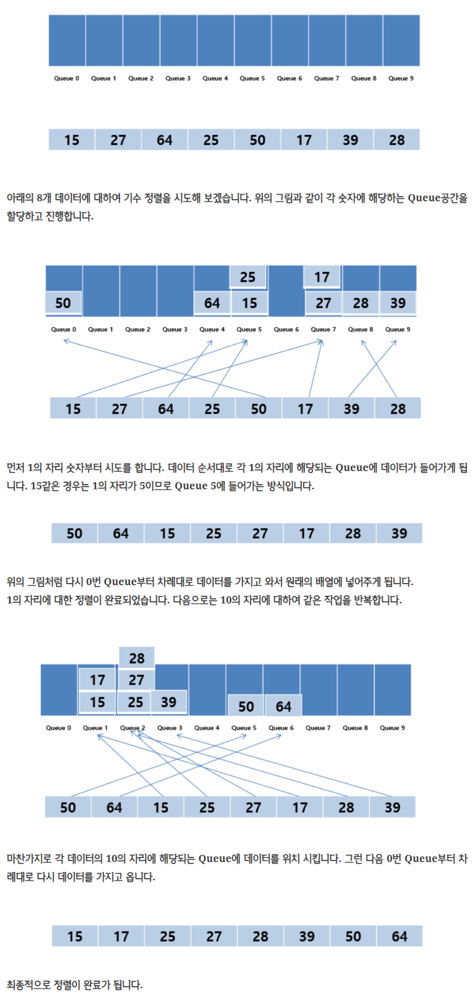

[:file_folder: **Algorithm List**](https://github.com/dlalstj0213/Study.Algorithm_Java)

[:arrow_backward: **BACK**](../)

---

# 기수 정렬 ( Radix Sort )

> [이미지 출처 : [herong.tistory.com](https://herong.tistory.com/entry/%EA%B8%B0%EC%88%98%EC%A0%95%EB%A0%ACRidix-Sort?category=818669?category=818669)]

## 개념
### 요약

- 기수정렬은 낮은 자리수부터 비교하여 정렬해 간다는 것을 기본 개념으로 하는 정렬 알고리즘입니다. 
- 기수정렬은 비교 연산을 하지 않으며 정렬 속도가 빠르지만 데이터 전체 크기에 기수 테이블의 크기만한 메모리가 더 필요합니다.
- **과정설명**
  1. 0~9 까지의 Bucket(Queue 자료구조의)을 준비한다.
  2. 모든 데이터에 대하여 가장 낮은 자리수에 해당하는 Bucket에 차례대로 데이터를 둔다.
  3. 0부터 차례대로 버킷에서 데이터를 다시 가져온다.
  4. 가장 높은 자리수를 기준으로 하여 자리수를 높여가며 2번 3번 과정을 반복한다.

### 자세히

> [이미지 출처 : [lktprogrammer.tistory.com](https://lktprogrammer.tistory.com/48)]

## 특징

### 장점

- 아무리 큰 배열일지라도, 항상 O(n) 의 복잡도를 유지한다.
- 안정정렬이다. ( 데이터들 간의 상대적 순서 유지)
- 자리수를 비교해 정렬하기때문에 문자열도 정렬이 가능하다.

### 단점

- 자릿수가 없는 것은 정렬이 불가능 하다.
- 정수와 같은 자료에서만 사용 가능하다.
- 소수점이 붙거나, 숫자가 아닐 경우에는 사용할 수 없다.
- 추가적인 메모리 공간이 필요하다.

## JAVA Code
- [RadixSort.java](./RadixSort.java)

## References

- https://lktprogrammer.tistory.com/48
- https://herong.tistory.com/entry/%EA%B8%B0%EC%88%98%EC%A0%95%EB%A0%ACRidix-Sort?category=818669?category=818669
- https://journee912.tistory.com/54
- https://javannspring.tistory.com/234

---

[:arrow_up_small: **Top**](#)