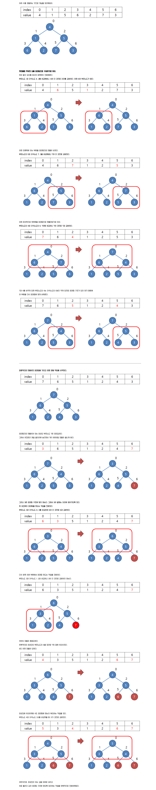

[:file_folder: **Algorithm List**](https://github.com/dlalstj0213/Study.Algorithm_Java)

[:arrow_backward: **BACK**](../)

---

# 힙 정렬 ( Heap Sort )

> [이미지 출처 : Heap Sort Animation *.wikipedia*]

## 자료구조 힙( Heap )

- **완전 이진 트리의 일종으로** 우선순위 큐를 위하여 만들어진 자료구조
- 최댓값, 최솟값을 쉽게 추출할 수 있는 자료구조

## 개념
### 요약

- 최대 힙 트리나 최소 힙 트리를 구성해 정렬을 하는 방법
- 내림차순 정렬을 위해서는 최대 힙을 구성하고 오름차순 정렬을 위해서는 최소 힙을 구성하면 된다.
- **과정 설명**
  1. 정렬해야 할 n개의 요소들로 최대 힙(완전 이진 트리 형태)을 만든다.
     - 내림차순을 기준으로 정렬
  2. 그 다음으로 한 번에 하나씩 요소를 힙에서 꺼내서 배열의 뒤부터 저장하면 된다.
  3. 삭제되는 요소들(최댓값부터 삭제)은 값이 감소되는 순서로 정렬되게 된다.

### 자세히

> [이미지 출처 : [hmkim829.tistory](https://hmkim829.tistory.com/9)]

## 특징

### 장점

- 시간 복잡도가 좋은편
- **가장 크거나 작은 값을 구할 때** 유용하다. (최소 힙 또는 최대 힙의 루트 값이기 때문에 한번의 힙 구성을 통해 쉽게 구할 수 있다.)
- 최대 k 만큼 떨어진 요소들을 정렬할 때 유용하다. (일반적으로 삽입정렬을 활용할 수 있지만, 힙 정렬을 통해서 더욱 개선할 수 있다.)

### 단점

- 데이터들의 상태에 따라 다른 정렬법들에 비해서 조금 느린편이다.
- 데이터의 순서가 바뀌는 unstable한 알고리즘이다. (불안정 정렬)

사실상 대부분의 경우 퀵정렬 또는 합병정렬의 성능이 좋기 때문에 힙 정렬의 사용빈도는 높지않다.

그렇다고 힙 자료구조 자체의 사용빈도를 말하는 것은 아니다.
**주의할 점은 부모-자식 관계간의 이야기이고, 형제간은 고려하지 않는다.**

## References

- https://gmlwjd9405.github.io/2018/05/10/algorithm-heap-sort.html
- https://hmkim829.tistory.com/9
- https://mygumi.tistory.com/310
- https://mygumi.tistory.com/94

---

[:arrow_up_small: **Top**](#)